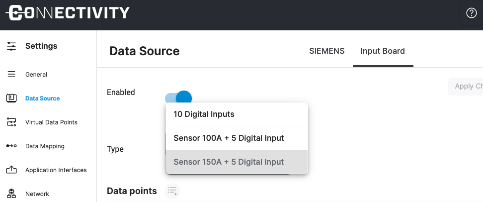
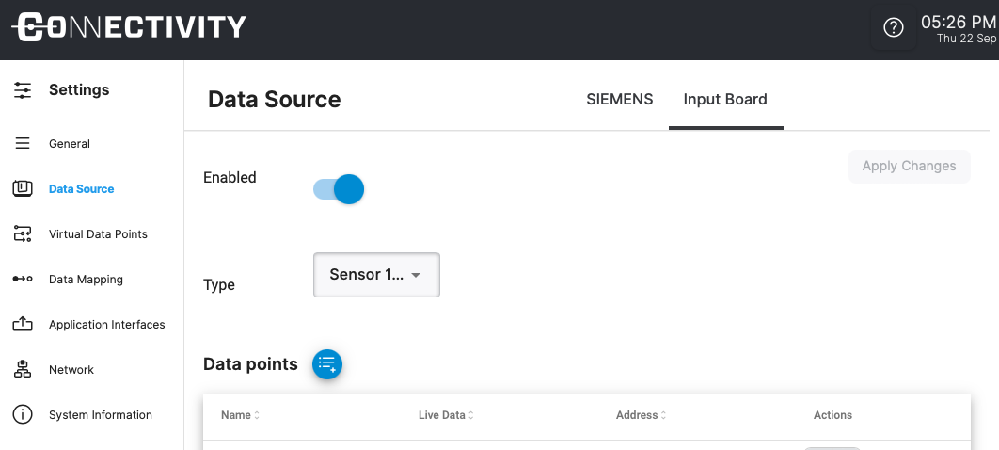

## Introduction

With this data source you can connect electrical signals to your IoT connector flex device. The signals can either be digital (Sink or Source, 0V/24V) or analog inputs (0-10V or 0-20mA). This is especially useful if you want to connect older equipment without a digital control or a machine where access to the control is not possible.

On the top of the page you find the main settings for the data source: Enabling and selecting the type.

## Changing the type of the ioshield

You can use the Type dropdown menu on the top of the page to change select which type of ioshield you are using.

## Default Configuration

By default the Data Source is configured the following way:

- DI0 - Emergency Stop
- DI1 - Stack Light: Red
- DI2 - Stack Light: Yellow
- DI3 - Stack Light: Green
- DI4 - Stack Light: Blue
- AI0 - Current Sensor
- AI1 - Not used

## Adding Data Points

To add a data point, click on the blue `Add Data Point` button .

Newly added data points are shown at the bottom of the table. You need to give a name and select the address of the data point and save it. After all changes please click `Apply Changes` on the top right of the page.
