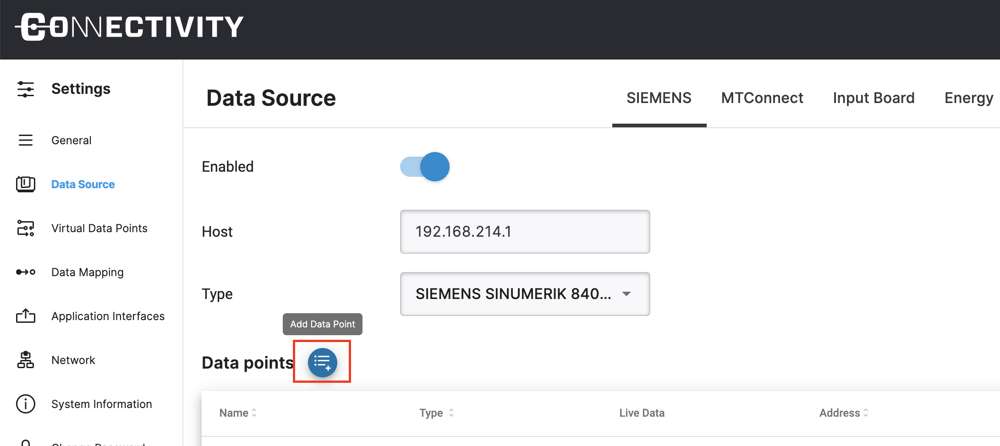

## Introduction

With this data source you can connect Siemens Sinumerik 840D SL controls. You can read data points from the NCK and the PLC part of the 840D.

On the top of the page you find the main settings for the data source: Enabling, entering IP address and selecting the type.

## Changing the type of the Siemens data source

You can use the Type dropdown menu on the top of the page to change select which type of ioshield you are using.

## Adding new Data Points

To add a new NCK data point click on the blue `Add Data Point` button  on the top left of the table.

New data point is added to the end of the list. In the new data point, give a name and you can select between "NCK" and "PLC" variables. You will need to provide the address of the data point when you choose PLC as type or select a variable when you choose NCK as type. After you are done, click green Save button at the end of the row. To apply all variable changes you made, please click `Apply Changes` button on the top right side of the page.

### NCK Data Points

For NCK you can select from a list of BTSS string like variable addresses, under the Address column by using `Select` button , as seen in the image above. After you added or changed a variable, its value is available in the runtime.

### PLC Data Points

The data point addresses are slightly different than the variable addresses used in Step 7 or TIA Portal. The main difference is that the data point address includes the data type, so that the IoT connector flex can decode the raw bytes properly. You can enter a data point address string in the text field under Address column on the data point row.

Here are some examples to guide you in addressing your variables:

| Address                     | Step7 equivalent | JS Data type | Description                                            |
| --------------------------- | ---------------- | ------------ | ------------------------------------------------------ |
| `DB5,X0.1`                  | `DB5.DBX0.1`     | Boolean      | Bit 1 of byte 0 of DB 5                                |
| `DB23,B1` or `DB23,BYTE1`   | `DB23.DBB1`      | Number       | Byte 1 (0-255) of DB 23                                |
| `DB100,C2` or `DB100,CHAR2` | `DB100.DBB2`     | String       | Byte 2 of DB 100 as a Char                             |
| `DB42,I3` or `DB42,INT3`    | `DB42.DBW3`      | Number       | Signed 16-bit number at byte 3 of DB 42                |
| `DB57,WORD4`                | `DB57.DBW4`      | Number       | Unsigned 16-bit number at byte 4 of DB 57              |
| `DB13,DI5` or `DB13,DINT5`  | `DB13.DBD5`      | Number       | Signed 32-bit number at byte 5 of DB 13                |
| `DB19,DW6` or `DB19,DWORD6` | `DB19.DBD6`      | Number       | Unsigned 32-bit number at byte 6 of DB 19              |
| `DB21,R7` or `DB21,REAL7`   | `DB21.DBD7`      | Number       | Floating point 32-bit number at byte 7 of DB 21        |
| `DB2,S7.10`\*               | -                | String       | String of length 10 starting at byte 7 of DB 2         |
| `I1.0` or `E1.0`            | `I1.0` or `E1.0` | Boolean      | Bit 0 of byte 1 of input area                          |
| `Q2.1` or `A2.1`            | `Q2.1` or `A2.1` | Boolean      | Bit 1 of byte 2 of output area                         |
| `M3.2`                      | `QM3.2`          | Boolean      | Bit 2 of byte 3 of memory area                         |
| `IB4` or `EB4`              | `IB4` or `EB4`   | Number       | Byte 4 (0 -255) of input area                          |
| `QB5` or `AB5`              | `QB5` or `AB5`   | Number       | Byte 5 (0 -255) of output area                         |
| `MB6`                       | `MB6`            | Number       | Byte 6 (0 -255) of memory area                         |
| `IC7` or `EC7`              | `IB7` or `EB7`   | String       | Byte 7 of input area as a Char                         |
| `QC8` or `AC8`              | `QB8` or `AB8`   | String       | Byte 8 of output area as a Char                        |
| `MC9`                       | `MB9`            | String       | Byte 9 of memory area as a Char                        |
| `II10` or `EI10`            | `IW10` or `EW10` | Number       | Signed 16-bit number at byte 10 of input area          |
| `QI12` or `AI12`            | `QW12` or `AW12` | Number       | Signed 16-bit number at byte 12 of output area         |
| `MI14`                      | `MW14`           | Number       | Signed 16-bit number at byte 14 of memory area         |
| `IW16` or `EW16`            | `IW16` or `EW16` | Number       | Unsigned 16-bit number at byte 16 of input area        |
| `QW18` or `AW18`            | `QW18` or `AW18` | Number       | Unsigned 16-bit number at byte 18 of output area       |
| `MW20`                      | `MW20`           | Number       | Unsigned 16-bit number at byte 20 of memory area       |
| `IDI22` or `EDI22`          | `ID22` or `ED22` | Number       | Signed 32-bit number at byte 22 of input area          |
| `QDI24` or `ADI24`          | `QD24` or `AD24` | Number       | Signed 32-bit number at byte 24 of output area         |
| `MDI26`                     | `MD26`           | Number       | Signed 32-bit number at byte 26 of memory area         |
| `ID28` or `ED28`            | `ID28` or `ED28` | Number       | Unsigned 32-bit number at byte 28 of input area        |
| `QD30` or `AD30`            | `QD30` or `AD30` | Number       | Unsigned 32-bit number at byte 30 of output area       |
| `MD32`                      | `MD32`           | Number       | Unsigned 32-bit number at byte 32 of memory area       |
| `IR34` or `ER34`            | `IR34` or `ER34` | Number       | Floating point 32-bit number at byte 34 of input area  |
| `QR36` or `AR36`            | `QR36` or `AR36` | Number       | Floating point 32-bit number at byte 36 of output area |
| `MR38`                      | `MR38`           | Number       | Floating point 32-bit number at byte 38 of memory area |
| `DB1,DT0`                   | -                | Date\*\*     | A timestamp in the DATE_AND_TIME format                |
| `DB1,DTZ10`                 | -                | Date\*\*     | A timestamp in the DATE_AND_TIME format, in UTC        |
| `DB2,DTL2`                  | -                | Date\*\*     | A timestamp in the DTL format                          |
| `DB2,DTLZ12`                | -                | Date\*\*     | A timestamp in the DTL format, in UTC                  |

- \*) Note that strings in S7 PLCs use two extra bytes at start for size & length of the string
- \*\*) Note that in the IoTconnector flex, `Date` data types are _always_ represented in UTC.
