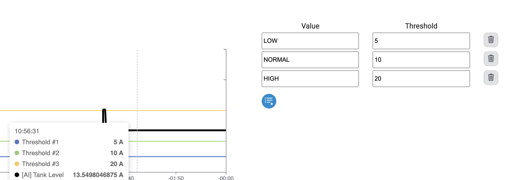

# Virtual Data Points (VDPs)

## Introduction

Virtual Data Point (VDP) is a feature to create a calculated data point from one or more real data points. A previously defined virtual data point can also be used as an input to a VDP. There are many linking operations available.

Important: If a virtual data point is defined as source of another virtual data point, the source virtual data point must be defined before it is used!

Note: All operations except `Calculation` convert the source value into true/false (boolean) while evaluating for the VDP:

- If the source value is a number: Any value above 0 becomes `true` and 0 value becomes `false`
- If the source value is not number but a text: Any text length above 0 characters is interpreted as `true` whereas empty text "" becomes `false`

### How to Add a Virtual Data Point

1. Click the blue button with the white plus icon. A new line is added to the list of Virtual Data Points table.
2. Enter a name for your new generated VDP
3. Select an operator
4. Select one or multiple sources
   
5. For operator specific details and settings see relevant operator's description below. For some operators you must provide extra information to be able to save.
6. Click the green check button on the right in `Actions` column to save and stop editing or click the red cross to discard your entry.
7. Click the `Apply Changes` button on top right of the page to send your new data point the the device.

### Available Operators

Note: If you need a combination of operations please read the `Combine Operations` section.

##### AND

_Logical AND:_ returns true if all selected data points values are true
Multiple selection of sources is possible.

##### OR

_Logical OR:_ Returns true if at least one selected data point value is true
Multiple selection of sources is possible.

##### NOT

_Logical NEGATION:_ Returns false if the data point value is true and vice versa
Only one source can be selected.

##### COUNT

Counts every state change (rising flag of the source) of a data point and shows as a number.

Counters are persistent across reboots. If you need to reset counters, you must delete the file where there are stored.

Only one source can be selected for counting.

##### THRESHOLDS

Returns defined value if threshold is exceeded, multiple thresholds are possible for one data point.

While adding the variable choose Set Threshold button on the right to add threshold levels:

Enter desired thresholds and corresponding `value` which will be the value of the VDP if given threshold is exceeded.

In the example above, the virtual data point called `Tank Status` is connected to `[AI] Tank Level` data source which has currently value 8.23 and with the given thresholds, the virtual data point's value will be `NORMAL`.

##### ENUMERATION

Returns a text that is matching to the value of the source. These are provided via the `Set Enumeration` button on `Action` column as seen below.

In Set Enumeration view, you can give a default value, which will be showed if none of the defined conditions are met

By clicking blue plus sign, you can add new conditions. For each such conditions, you need to choose a variable to be observed and the text to be shown if the source value becomes `true` by typing it under "Value if left side is true" column.

An example with certain values can be seen here:

##### GREATER

Returns true if the data point value is greater than the other compared data point value.

If you need true when it is equal as well, please use `Greater Equal` operator.

To provide the compared value, use the `Set Comparative Value` button on the `Action`column of the row.

##### GREATER EQUAL

Returns true if the data point value is greater than or equal to the other compared data point value.

To provide the compared value, use the `Set Comparative Value` button on the `Action`column of the row.

##### SMALLER

Returns true if the data point value is smaller than the other compared data point value.

If you need true when it is equal as well, please use `Smaller Equal` operator

To provide the compared value, use the `Set Comparative Value` button on the `Action`column of the row.

##### SMALLER EQUAL

Returns true if the data point value is less than or equal to the other compared data point value.

To provide the compared value, use the `Set Comparative Value` button on the `Action`column of the row.

##### EQUAL

Returns true if the data point value is equal to the other compared data point value.

To provide the compared value, use the `Set Comparative Value` button on the `Action`column of the row.

##### UNEQUAL

Returns true if the data point value is _not_ equal to the other compared data point value.

To provide the compared value, use the `Set Comparative Value` button on the `Action`column of the row.

##### CUSTOM CALCULATION EXPRESSION

Custom mathematical expression using variable names and manually typing the mathematical equations. It is useful when several data points need to be combined and in more complex mathematical operations.

Example to be provided.

### Combined Operations

There are two ways to create combined operations: through `Custom Calculation Expression` or creating new VDPs and combining these.

For `Custom Calculation Expression` please refer the explanation above.

For example, to create following equation with multiple VDPs:
_DP1 & DP2 & !DP3_

1. Create a first VDP1 with DP1 and DP2, AND operation
2. Create a second VDP2 with DP3, NOT operation
3. Create a third final VDP3 with VDP1, VDP2, AND operation
4. The result will be equal to the VDP3 value

### How to Delete a Virtual Data Point

1. Click on right side of the entry you want to delete in `Actions` column the garbage icon
2. Select Yes in the popped up overlay with the question: "Are you sure you want to delete data point [datapoint name]?"
3. Click the `Apply Changes` button to send the change to the backend
